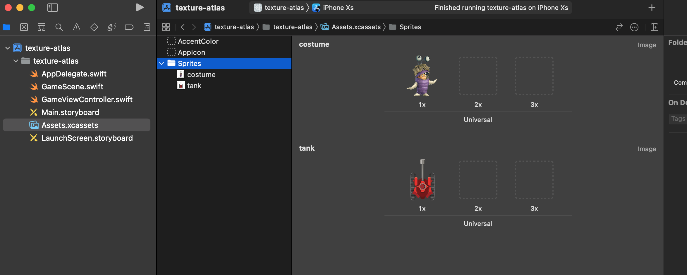

# SpriteAtlas draw calls NOT batched

Sample Xcode 13 project using a Sprite Atlas inside an Assets Catalog.

- When using the [`SKTextureAtlas(named:)`](https://developer.apple.com/documentation/spritekit/sktextureatlas/1427381-init) initializer to load the texture atlas from data stored in the app bundle, the draw calls are not batched.
- When using the [`SKTextureAtlas(dictionary:)`](https://developer.apple.com/documentation/spritekit/sktextureatlas/1427383-init) initializer to create a texture atlas from a set of image files, the draw calls are batched.

Related questions:

- TODO

## Visual

Here, there are 2 draw calls, one for each sprite node:


Here, there is only 1 draw call, batched:


The SpriteAtlas in the Assets Catalog:



The code is very simple, in  [GameScene.swift](https://github.com/clns/spritekit-atlas-batching/blob/main/texture-atlas/GameScene.swift):

```swift
import SpriteKit

class GameScene: SKScene {
    
    override func didMove(to view: SKView) {
        let atlas = SKTextureAtlas(named: "Sprites")
//        let atlas = SKTextureAtlas(dictionary: ["costume": UIImage(named: "costume")!, "tank": UIImage(named: "tank")!])
        
        let costume = SKSpriteNode(texture: atlas.textureNamed("costume"))
        costume.setScale(0.3)
        costume.position = CGPoint(x: 200, y: 650)
        
        let tank = SKSpriteNode(texture: atlas.textureNamed("tank"))
        tank.setScale(0.3)
        tank.position = CGPoint(x: 500, y: 650)
        
        addChild(costume)
        addChild(tank)
    }
}
```
